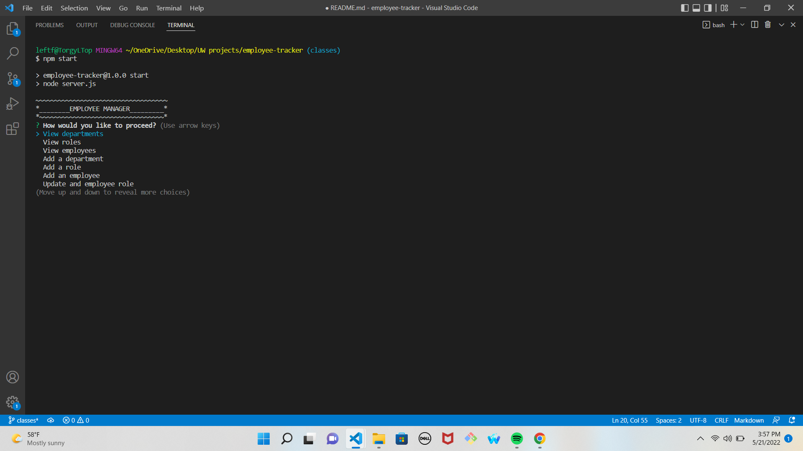

  # Employee Tracker

  ## Description
  An easy straight forward command line application storing Employee and Department data in a mySQL database.
  

  ## Table of Contents
  [Description](#description)    
  [Installation](#installation)  
  [Usage](#usage)  
  [License](#license)  
  [Contributing](#contributing)  
  [Tests](#tests)  
  [Questions](#questions)

  ## Installation
  Make sure you have mysql download on to your computer and then download the source code and make sure to 'npm init' and 'npm install mysql2 inquirer console.table'. You can also 'npm dotenv' and make a .env to hide mysql connection credentials. 

  ## Usage
  Run 'npm start' or 'node server.js' in command line.
  [Walkthrough](https://drive.google.com/file/d/1LnvD_Nfd_raD4j20siAWBTfaERUer1mV/view)

  ## License 
  There are no licenses associated with this project.

  ## Contributing
  UW Coding Bootcamp

  ## Tests
  NA

  ## Questions
  Please direct any comments or inquiries using the resources below:  
  GitHub: [T0rgy](https://github.com/t0rgy)  
  Email: <JCTORGE@gmail.com>